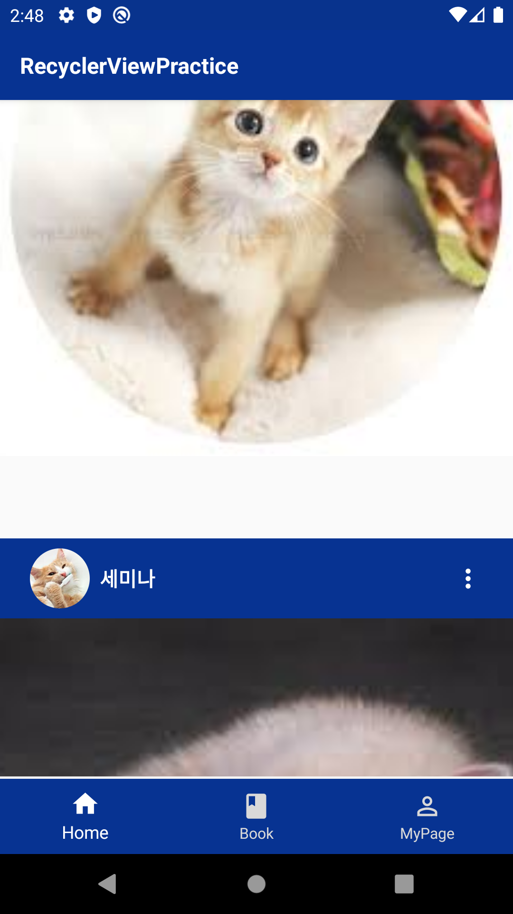
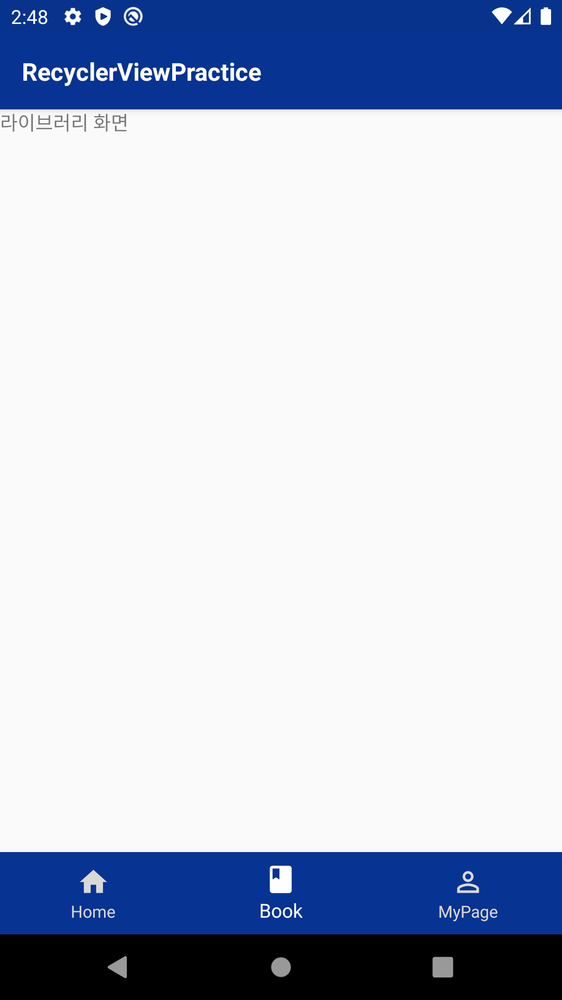
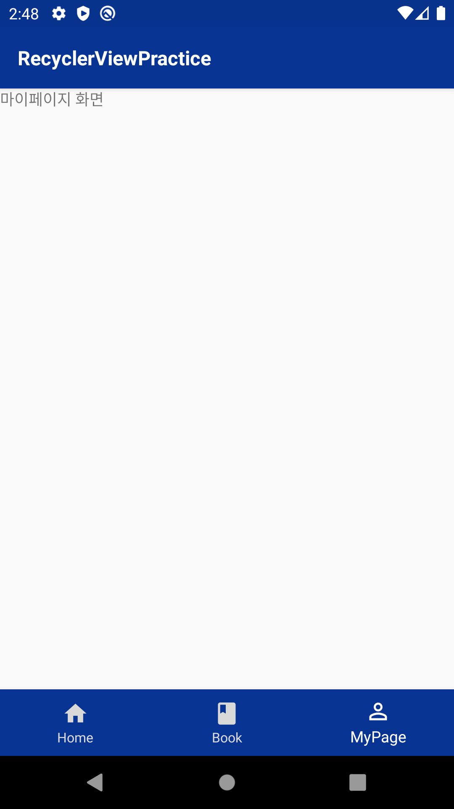

# SOPT-Android-Assignment
sopt 안드로이드 파트 세미나 과제

## 1st assignemt
1차 세미나 시작 전 사전 과제
>프로젝트 생성 및 초기화

## 2nd assignemnt
1차 세미나 후 과제

### Primary-AdvancedConstraintLayout
>ConstraintDimentionRatio를 이용하여 View의 가로세로 길이의 비를 설정할 수 있다.
>이를 위해선 가로와 세로 길이가 제약조건에 일치 상태여야 한다.

### Primary-LoginAndJoin
>회원가입 액티비티에서 입력한 데이터를 로그인 액티비티에 자동으로 입력되게 하기 위해서는 두 액티비티 간의 데이터 통신이 필요하다
>로그인 액티비티에서 회원가입 액티비티를 실행할 때, ```startActivityForResult()``` 메서드를 사용하면 된다.
>회원가입 액티비티에서는 입력을 마치고 로그인 액티비티로 돌아가기 전 ```Intent``` 의 ```putExtra()``` 를 사용하여 입력 데이터를 곱게 담아 로그인 액티비티로 넘겨줄 수 있다.
>로그인 액티비티가 다시 실행될 때는 ```onActivityResult()``` 메서드가 호출되는데, 여기서 ```Intent```의 데이터를 꺼내 ```EditText```에 적용해주면 된다.

### Nullable-LayoutPracticeForLoginActivity
>로그인 액티비티를 LinearLayout, RelativeLayout, ConstraintLayout 으로 각각 구현을 해 보았다.
>각 레이아웃은 장단점이 있으나 로그인 액티비티의 경우 동일한 입력창이 세로로 나열된 구조이기 때문에 LinearLayout이 조금 더 유리한듯 하다.

## 3rd assignment
2차 세미나 후 과제

### Primary-RecyclerViewPractice
>프래그먼트와 뷰페이저, 리사이클러뷰를 동시에 실습하였다.</br>
</img>
</img>
</img>
</img>

>```itemDecoration```은 각 아이템에 대한 데코레이션을 적용할 수 있는데 대표적으로 구분선이나 여백을 두는 것에 자주 사용된다
>이번 실습에서는 여백을 ```15dp``` 주는 방법으로 해보았다.
>모든 아이템마다 하단 여백을 주고, 마지막 아이템이라면 여백을 주지 않는다.
>가로 리사이클뷰에도 적용이 가능하도록 리스트 방향을 매개변수로 받도록 하였다.
>```clippingToPadding```은, 리사이클러뷰가 패딩 값을 가지고 있을 때, 해당 패딩 공간을 스크롤의 영역으로 활용할지에 대한 여부이다.
>기본적으로는 ```false```가 설정되어 있으며, 대부분의 경우 ```true```로 설정하는 것이 사용자로 하여금 훨씬 답답함을 줄여줄 수 있다.

## 4th assignment
3차 세미나 후 과제

### Primary-LoginAndJoinWithRetrofit
>Retrofit을 이용하여 로그인과 회원가입을 구현하였다.
>RESTful API에 접근하여 회원가입을 한 후, 동일한 아이디와 비밀번호로 로그인을 시도할 수 있었다.
>로그인이 성공하면 2차 세미나 후 과제로 만든 RecyclerView가 나타나도록 하였다.
